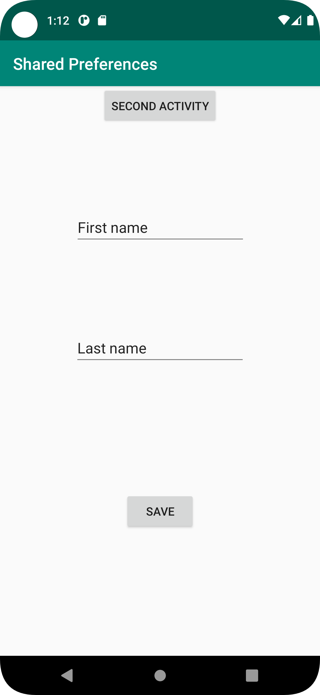
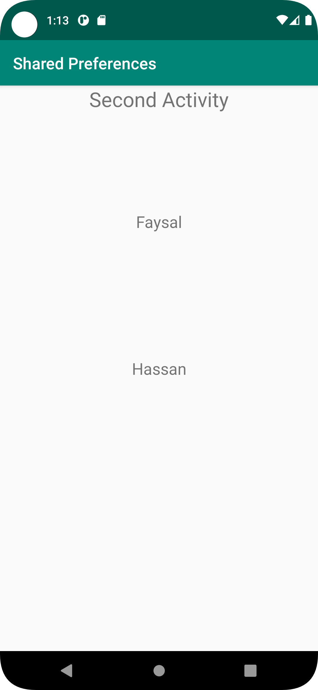

# Rapport
Started the assignment by first adding a second activity and it's corresponding xml file.
Secondly i added 2 Edit texts to the main xml file that will be used to take input and 2 buttons.
The first button will be used to start the second activity and the second one for saving the data input from the EditText views.


```
    <Button
        android:id="@+id/secondActivity_btn"
        android:layout_width="wrap_content"
        android:layout_height="wrap_content"
        android:text="Second Activity"

        app:layout_constraintEnd_toEndOf="parent"
        app:layout_constraintStart_toStartOf="parent"
        app:layout_constraintTop_toBottomOf="@+id/appBarLayout" />

    <Button
        android:id="@+id/save_button"
        android:layout_width="wrap_content"
        android:layout_height="wrap_content"
        android:text="Save"
        app:layout_constraintBottom_toBottomOf="parent"
        app:layout_constraintEnd_toEndOf="parent"
        app:layout_constraintStart_toStartOf="parent"
        app:layout_constraintTop_toBottomOf="@+id/edit_efternamn" />

    <EditText
        android:id="@+id/edit_förnamn"
        android:layout_width="wrap_content"
        android:layout_height="wrap_content"
        android:ems="10"
        android:inputType="textPersonName"
        android:text="First name"
        app:layout_constraintBottom_toTopOf="@+id/edit_efternamn"
        app:layout_constraintEnd_toEndOf="parent"
        app:layout_constraintHorizontal_bias="0.502"
        app:layout_constraintStart_toStartOf="parent"
        app:layout_constraintTop_toBottomOf="@+id/secondActivity_btn" />

    <EditText
        android:id="@+id/edit_efternamn"
        android:layout_width="wrap_content"
        android:layout_height="wrap_content"
        android:ems="10"
        android:inputType="textPersonName"
        android:text="Last name"
        app:layout_constraintBottom_toBottomOf="parent"
        app:layout_constraintEnd_toEndOf="parent"
        app:layout_constraintStart_toStartOf="parent"
        app:layout_constraintTop_toTopOf="parent" />


```

In the second activity xml file i added 3 text views, two of which will be used to store the data from the edit text views in main activity
and the third to just show that we are on the second actvity.


```
<TextView
        android:id="@+id/first_name"
        android:layout_width="wrap_content"
        android:layout_height="wrap_content"
        android:textSize="20sp"
        android:text="First name"
        app:layout_constraintBottom_toTopOf="@+id/last_name"
        app:layout_constraintEnd_toEndOf="parent"
        app:layout_constraintHorizontal_bias="0.5"
        app:layout_constraintStart_toStartOf="parent"
        app:layout_constraintTop_toTopOf="parent" />

    <TextView
        android:id="@+id/last_name"
        android:layout_width="wrap_content"
        android:layout_height="wrap_content"
        android:text="Last name"
        android:textSize="20sp"
        app:layout_constraintBottom_toBottomOf="parent"
        app:layout_constraintEnd_toEndOf="parent"
        app:layout_constraintHorizontal_bias="0.5"
        app:layout_constraintStart_toStartOf="parent"
        app:layout_constraintTop_toTopOf="parent" />

    <TextView
        android:id="@+id/secondActivity_textView"
        android:layout_width="wrap_content"
        android:layout_height="wrap_content"
        android:text="Second Activity"
        android:textSize="25sp"
        app:layout_constraintEnd_toEndOf="parent"
        app:layout_constraintStart_toStartOf="parent"
        app:layout_constraintTop_toTopOf="parent" />


```

In the main activity class i created my views, Shared Prefernce object and Shared preference Editor as private member variables.
Also added 2 strings that will be used get the data from the edit text views.


```
public class MainActivity extends AppCompatActivity {
    private Button btn1, btn2;
    private SharedPreferences sharedPreferences;
    private SharedPreferences.Editor sharedPrefEdit;
    private EditText förnamn, efternamn;
    private String förnamnStr, efternamnStr;


```

In the onCreate method i used findById  to find the views and instanstiated my shared preference and editor.

```
protected void onCreate(Bundle savedInstanceState) {
        super.onCreate(savedInstanceState);
        setContentView(R.layout.activity_main);
        Toolbar toolbar = findViewById(R.id.toolbar);
        setSupportActionBar(toolbar);
        förnamn = findViewById(R.id.edit_förnamn);
        efternamn = findViewById(R.id.edit_efternamn);
        btn1 = findViewById(R.id.secondActivity_btn);
        btn2 = findViewById(R.id.save_button);
        sharedPreferences = getSharedPreferences("myPref",MODE_PRIVATE);
        sharedPrefEdit = sharedPreferences.edit();


```

Created OnClicklisteners for the buttons. The first button starts a new activity and has an intent implemented.
Second button gets the data from the editTexts views and assigns it to the strings we created earlier.
Inside the OnClickListener for the second button we also write data to the Shared preference editor by using the putString method that takes
a key and a value. Lastly we commit these changes to the shared preference by using the apply() method in the editor.


```
btn1.setOnClickListener(new View.OnClickListener() {
            @Override
            public void onClick(View view) {
                Intent intent = new Intent(MainActivity.this,SecondActivity.class);
                startActivity(intent);
            }
        });


btn2.setOnClickListener(new View.OnClickListener() {
            @Override
            public void onClick(View view) {
                förnamnStr = förnamn.getText().toString();
                efternamnStr = efternamn.getText().toString();
                sharedPrefEdit.putString("förnamn", förnamnStr);
                sharedPrefEdit.putString("efternamn", efternamnStr);
                sharedPrefEdit.apply();
            }
        });
```

In the second activity class we will read data from the shared preference, so we start by first created the textviews the will hold the data as memeber variables.
Also created to String to read the data from shared preference.

```
private TextView firstname, lastname;
private String firstNameStr, lastNameStr;

```

One of the hints from the assignment was to read from the shared preference in a OnResume() method instead of OnCreate() so that the written data is visible
In second activity even when the main activity is closed. So i implemented that method and read the data from in there. 

Firstly i needed to find my textView so i used findViewById method, after that we need access to the data that was stored in our shared preference,
so i used the getSharedPref method and assigned it to the local Shared pref object. 
The method takes 2 parameters, one of which is the name of the shared preference which we gave in the main activity and the second which is MODE PRIVATE.
Now that we have access to the shared preference and data inside of it we can assign that data to  our text views by using getString method. 

```

public void onResume(){
        super.onResume();
        firstname = findViewById(R.id.first_name);
        lastname = findViewById(R.id.last_name);
        SharedPreferences mySharedPref = getSharedPreferences("myPref", MODE_PRIVATE);

        firstNameStr = mySharedPref.getString("förnamn", "");
        lastNameStr = mySharedPref.getString("efternamn", "");

        firstname.setText(firstNameStr);
        lastname.setText(lastNameStr);


    }

```







